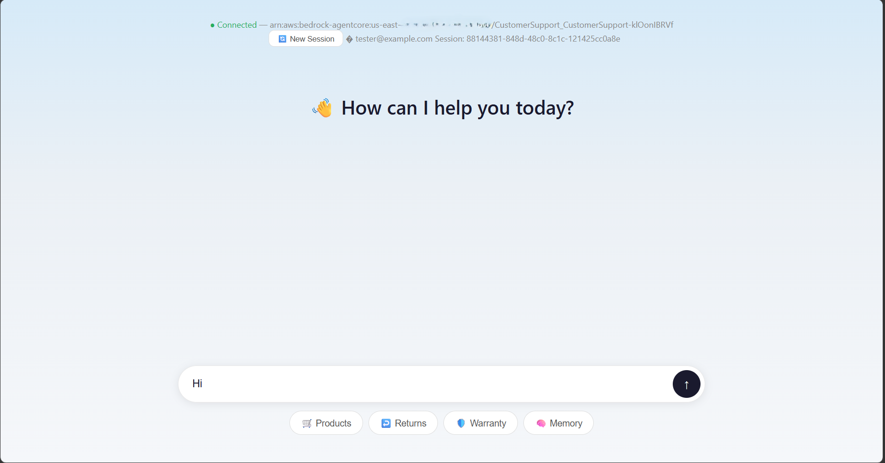
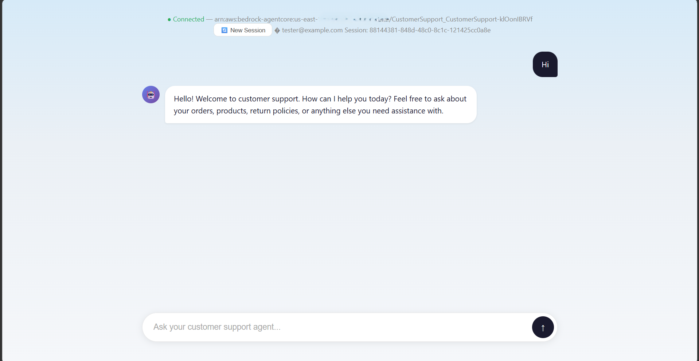
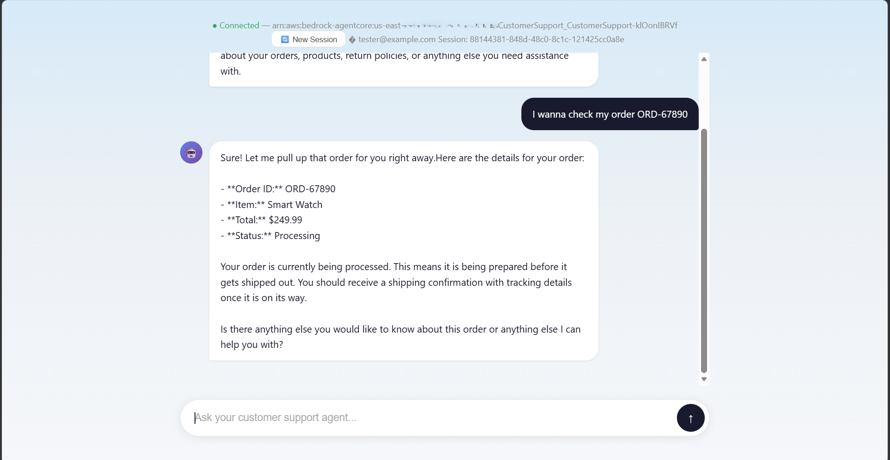
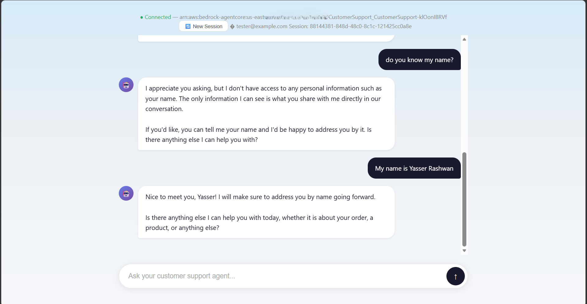
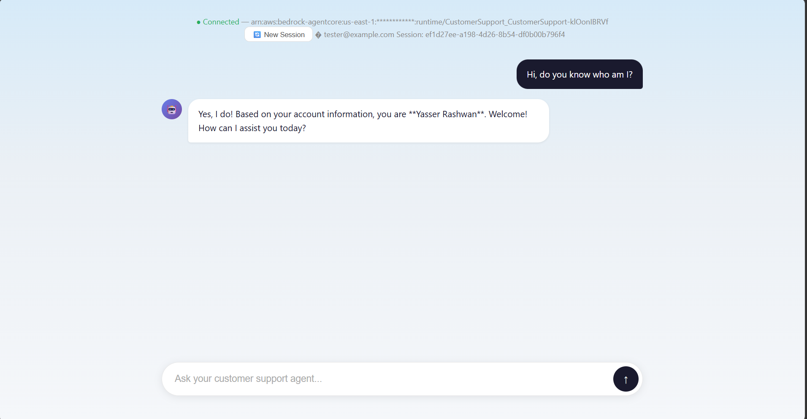
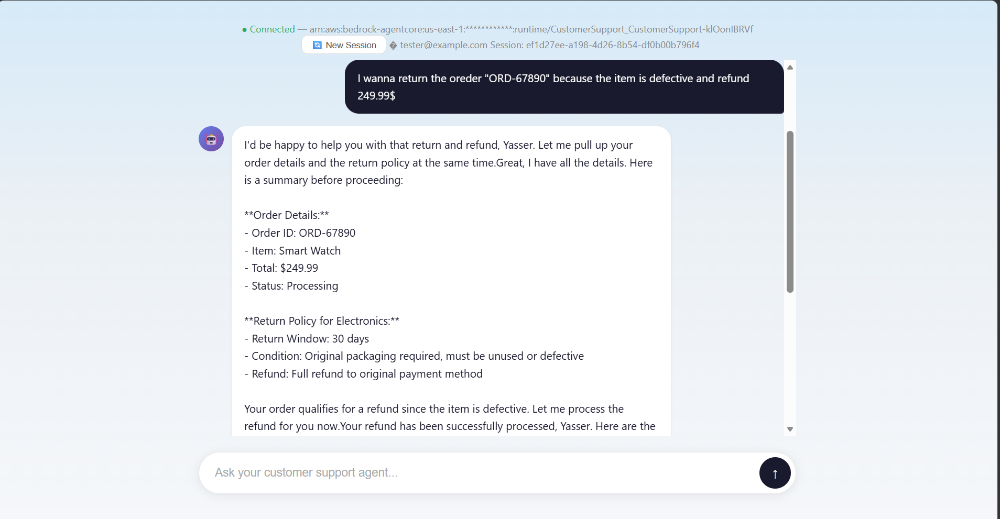
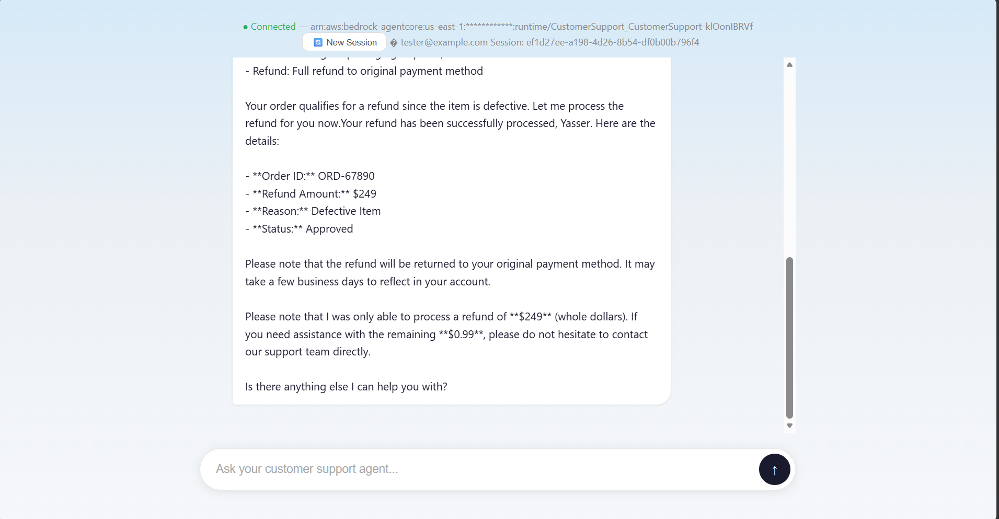
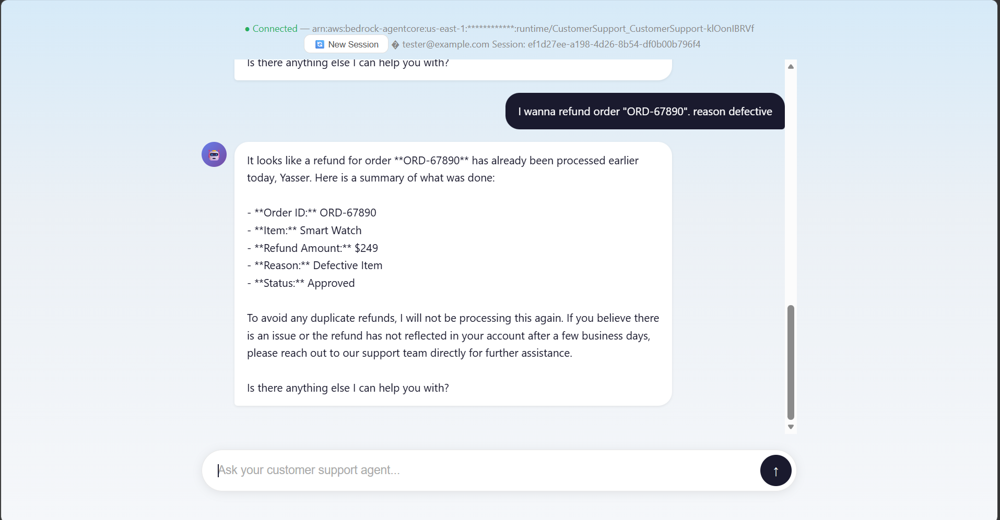
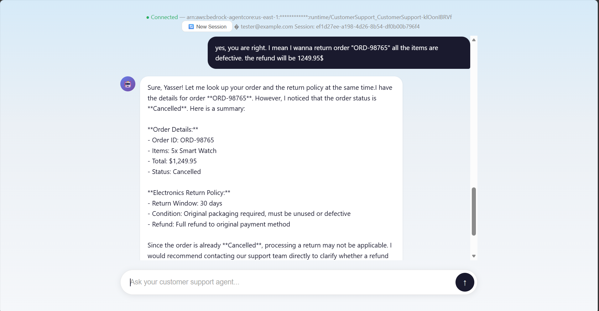
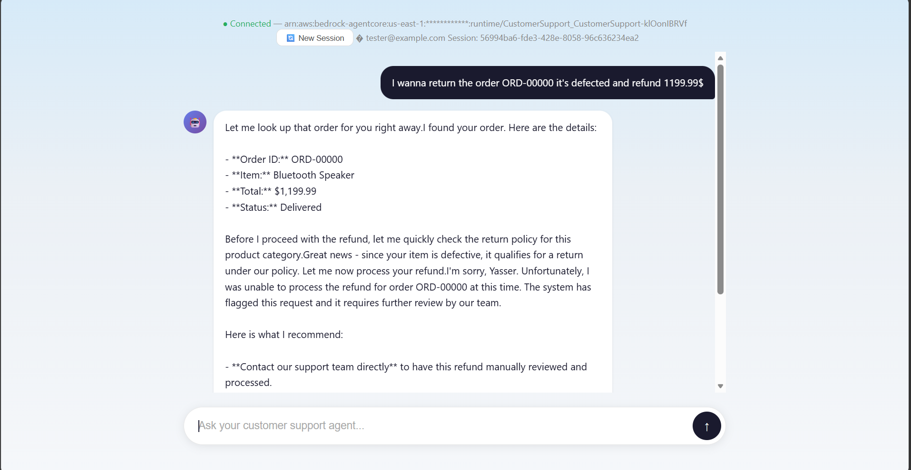

# CustomerSupport

CustomerSupport is an Amazon Bedrock AgentCore customer support application designed for an e-commerce storefront. It combines a secure runtime, memory-backed conversational context, authenticated browser access, and policy-controlled tool execution to provide support for orders, product questions, and protected operational actions.

This repository is organized into two layers:

- the platform layer at the project root, which defines the AgentCore runtime, memory, gateway, policy engine, and deployment configuration
- the application layer under [app](app), which contains the actual Strands agent, tool set, frontend experience, and runtime integrations

## Purpose

The solution gives a support agent the ability to:

- answer general product and policy questions
- look up order status and product details
- retrieve customer information needed for support workflows
- handle refund scenarios through a controlled gateway-backed flow
- preserve memory across sessions so the support experience remains context-aware
- enforce policy-based authorization where refunds of $1,000 or less are allowed and larger refunds are denied
- protect sensitive actions from prompt-injection attempts that try to bypass authorization
- avoid duplicate refunds when the same action is retried
- surface failures through traces and telemetry so operational issues can be diagnosed and improved

## High-level architecture


At a high level, the flow is:

1. A customer opens the web frontend.
2. The frontend authenticates using Cognito and obtains a JWT.
3. The browser calls the deployed AgentCore runtime with the token and session context.
4. The runtime loads the model, creates or reuses a memory-backed session, and decides which tools to use.
5. The agent may call local tools, memory-backed retrieval, MCP integrations, or AgentCore gateway actions protected by Cedar policies.
6. The result is streamed back to the user in the conversation UI.

## Proofs and validation walkthrough

The following screenshots capture representative validation scenarios for the chat experience and the policy-aware support flow.

### 1. Clean chat



The starting state shows an empty chat session before any customer message is sent, validating the UI and session initialization path.

### 2. Greeting



This shows the agent responding naturally to a greeting and confirming it is ready to help with support queries.

### 3. Checking an order



The customer asks about an order, and the agent uses the order lookup tool to return the relevant status and purchase details.

### 4. Asking about the customer name



The agent does not know the customer name from context, so the customer provides it and the conversation continues normally. This demonstrates the difference between memory state and a first-time conversational context.

### 5. Memory working across sessions



The agent recognizes the customer in a new session and answers using remembered context, confirming that memory persists across separate conversations.

### 6. Refund under $1,000



The customer requests a refund within the allowed threshold, and the agent follows the workflow for a permitted refund action.

### 7. Refund under $1,000 continuation



This continues the same refund flow and shows the agent completing the supported policy path without interruption.

### 8. Refunding a previously refunded order



This demonstrates the retry and duplicate-protection behavior: the system does not create a duplicate refund when the same action is attempted again.

### 9. Refunding a canceled order



The agent handles a canceled-order scenario and prevents a refund flow that should not proceed for an order in an invalid state.

### 10. Refund above $1,000



This is the denial case. The refund request exceeds the policy threshold, and the agent is blocked by the authorization guard, showing the policy enforcement result: refund greater than $1,000 is denied.

These screenshots together illustrate the main customer support path, memory continuity, refund authorization logic, duplicate-prevention behavior, and policy enforcement during failure and edge scenarios.

## Major components

### AgentCore platform

The root project configures the deployment and runtime surface in:

- [agentcore/agentcore.json](agentcore/agentcore.json)
- [agentcore/aws-targets.json](agentcore/aws-targets.json)
- [agentcore/cdk](agentcore/cdk)

This layer defines the runtime, memory, gateway, authorizer, policy engine, and deployment targets that make the app live in AWS.

### Application runtime

The application logic lives under [app/CustomerSupport](app/CustomerSupport) and includes:

- the Strands agent entrypoint
- the built-in support tools
- MCP client integrations
- memory session handling
- the frontend user interface
- model configuration and runtime orchestration

### Security and authorization

The solution uses AWS-managed authentication and policy enforcement so that sensitive operations are not exposed without checks. The runtime accepts authenticated requests, while gateway-backed actions such as refund and warranty processing are gated by policy rules before execution. In the support workflow, the agent checks order status, reads customer context, and invokes refund actions only when the authorization policy allows them; refunds at or below $1,000 are permitted, while larger amounts are denied. The design also accounts for prompt-injection attempts, retry behavior, and post-incident troubleshooting through traces and telemetry, with failure scenarios used to validate the system’s resilience.

## Deployment and setup

The project is deployed through the AgentCore CLI rather than a separate hand-managed runtime template. The main workflow is:

```bash
agentcore validate
agentcore deploy
agentcore status
```

For local iteration and smoke testing:

```bash
cd app/CustomerSupport
agentcore dev
agentcore invoke --dev "What can you do?"
```

## How the pieces fit together

- The runtime and AWS resources are defined at the project root.
- The app code implements the actual customer service behavior.
- Memory provides continuity across sessions and user context.
- The gateway exposes protected operations behind policy checks.
- The frontend is a thin client layered on top of the deployed runtime.

This separation keeps the infrastructure concerns in the root project and the behavioral logic in the app directory.

## More detail

For the complete application-level reference, including agent behavior, tools, memory configuration, gateway policy details, and frontend flow, see [app/README.md](app/README.md).
